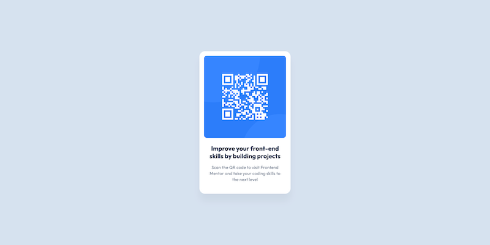

# Frontend Mentor - QR code component solution

This is a solution to the [QR code component challenge on Frontend Mentor](https://www.frontendmentor.io/challenges/qr-code-component-iux_sIO_H). Frontend Mentor challenges help you improve your coding skills by building realistic projects. 

## Table of contents

- [Overview](#overview)
  - [Screenshot](#screenshot)
  - [Links](#links)
- [My process](#my-process)
  - [Built with](#built-with)
  - [What I learned](#what-i-learned)
  - [Continued development](#continued-development)
  - [Useful resources](#useful-resources)
- [Author](#author)
- [Acknowledgments](#acknowledgments)

## Overview

### Screenshot

### Links

- Live Site URL: [GitHub Pages](https://bjoernzosel.github.io/qr-code-component-main/)

## My process

### Built with

- Semantic HTML5 markup
- CSS custom properties
- Flexbox
- Custom Font (Outfit) - Tanks to [Mario Ranftl](https://gwfh.mranftl.com/fonts)

### What I learned

- How to use the `srcset` attribute for responsive images
- How to use the `@font-face` rule to use a custom font
- How to reset the user agent stylesheet
- How to sort CSS properties in a logical order
- How to use Figma Dev Mode to inspect the design
- How to use font-feature-settings to disable ligatures and clig
- The necessity to use border-box for box-sizing
- How to use GitHub Pages to host the project
- How to use Markdown to write a README file
- How to use GH CLI to create a new repository

### Continued development

- Practice sorting CSS properties in a logical order
- Practice using GH CLI

## Author

- Website - [Björn Zosel](https://zosel.lu)
- Frontend Mentor - [@yourusername](https://www.frontendmentor.io/profile/yourusername)
- Twitter - [@bjoernzosel](https://www.twitter.com/bjoernzosel)

## Acknowledgments

My boy [Claude](https://claude.ai) for helping me with the code.